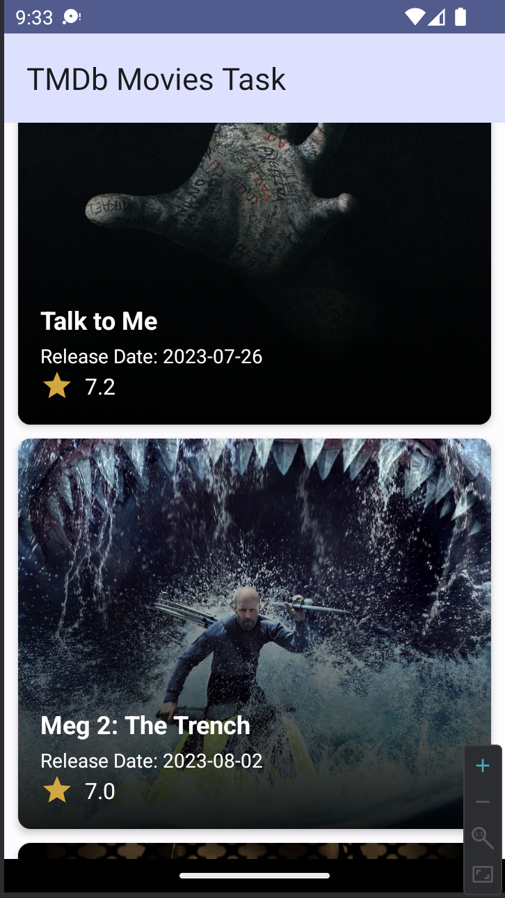
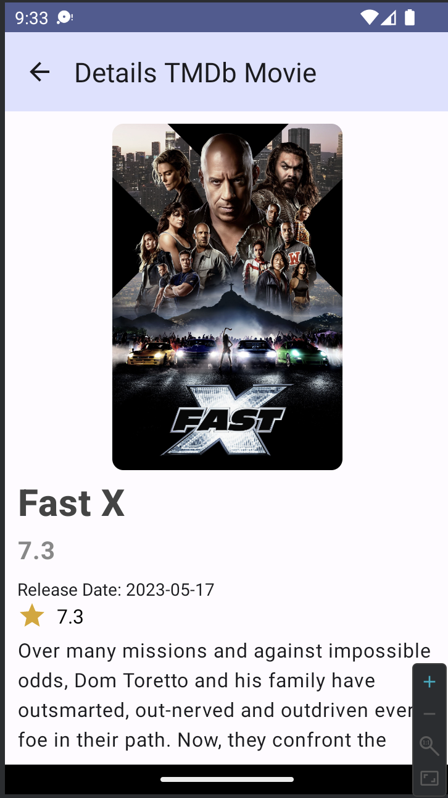

# Movie App

This Android application allows users to browse and discover popular movies using data fetched from The Movie Database (TMDb) API. It includes features such as displaying a list of movies, viewing movie details, local data caching, and unit testing.

## API Reference


This app uses data from [The Movie Database (TMDb) API](https://www.themoviedb.org/documentation/api). Please refer to the [official TMDb documentation](https://www.themoviedb.org/documentation/api) for more information.


## Features

### Task 1: Display Movies List
- Fetches a list of popular movies from the TMDb API using Retrofit.
- Displays the list of movies in a scrolling view.
- Each movie item includes the title, release date, and poster image.

### Task 2: Movie Details Screen
- When a user taps on a movie in the list, it displays more information about the selected movie.
- Shows movie details such as overview, rating, and genres.
- Includes a back button to return to the movie list.

### Task 3: Local Data Caching
- Implements local data caching using Room to store the fetched movie data in the app's local database.
- The app first attempts to fetch data from the local database before making an API request.

### Task 4: Unit Testing
- Includes unit tests for critical parts of the app, such as the domain layer and view model.

## Requirements

- Kotlin is used as the programming language.
- Jetpack Compose  for UI development.
- MVVM architecture is implemented for the data flow.
- Retrofit is used to fetch data from the TMDb API following the TMDb API documentation.
- Room is used for local data caching.
- Pagination is implemented for fetching more movies.
- Proper error handling is implemented.
- The code follows clean architecture principles.
- Good code organization, readability, and maintainability are ensured.
- Version control (e.g., Git) is used for tracking changes.

## Getting Started

To run the application locally, follow these steps:

1. Clone the repository: 
```
git clone git clone https://github.com/alfayedoficial/tmdbmoviestask.git
```
2. Open the project in Android Studio.

3. Build and run the app on an Android emulator or physical device.

## Demo APK

You can download the demo APK for the Movie App from the following link:

[Download Demo APK](https://github.com/alfayedoficial/tmdbmoviestask/blob/main/screen/app-debug.apk)

## Screenshots
<div align="center">


</div>

## License

This project is licensed under the [MIT License](LICENSE).
